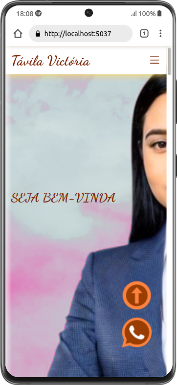

  
  

## Tópicos

 • <a href="#-sobre-o-projeto">Sobre o Projeto</a>  
 • <a href="#-tecnologias">Tecnologias</a>  
 • <a href="#-layout">Layout</a>  
 • <a href="#-funcionalidades">Funcionalidades</a>  
 • <a href="#-estrutura-de-pastas">Estrutura de pastas</a>  

## Sobre o projeto

Este projeto é destinado ao desenvolvimento de um sistema particular de gerenciamento de serviços e produdos prestados a um estabelecimento de carater estetico..

## Tecnologias

#### **Website**

- [Html](https://developer.mozilla.org/pt-BR/docs/Web/HTML)
- [Javascript](https://developer.mozilla.org/pt-BR/docs/Web/JavaScript)
- [Css](https://developer.mozilla.org/pt-BR/docs/Web/CSS)

#### **API e Framework**

- [Whatsapp](https://business.whatsapp.com/developers/developer-hub?lang=pt_BR)

#### **Utilitários**

  - **[Visual Studio Code](https://code.visualstudio.com/)** 
- Fontes: **[Inter](https://fonts.google.com/specimen/Inter?query=Inter)** + **[Dancing Script](https://fonts.google.com/specimen/Dancing+Script)** 
- Versionamento: **[Git](https://git-scm.com)**

## Layout

  

## Funcionalidades

Features que estão sendo adicionadas na aplicação

**Front-end Web**

- [X] Integração com Whatsapp

**Front-end Mobile**

- [x] Menu tropdown

## 🛠 Estrutura de pastas

Afim de facilitar a organização e manutenção do código, foi definido um padrão para organização das pastas neste projeto.

**Front-end Web**

- **/assets**: Arquivos pertinentes a pagina
  - **/components**: Separando elementos que se repetem em pequenos componentes
    - **/about-car**
    - **/burguer-menu**
    - **/button**
    - **/card-do-you-know**
    - **/card-hero**
    - **/card-services**
    - **/card-testimonials**
    - **/whatsapp-icon**

  - **/img**: Separando todas as imagens usadas na pagina
    - **/gallery**
    - **/github**
    - **/icons**
    - **/social-media**
    - **/tavila**
  - **/responsivity**: Arquivos css de responsividade Desktop, tablet e smartphone
  - **/setup**: Contem a organização de configurações css e js globais
  - **/templates**: Estilos de cada section individualizada presente na pagina.

